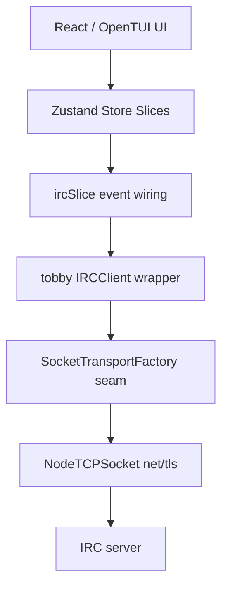
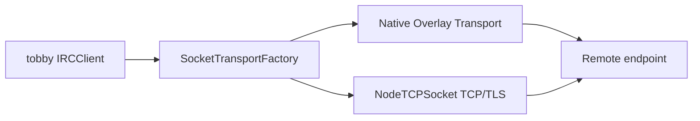

# tobby Architecture

## System overview

tobby is a terminal IRC client with a local-first architecture:

- React/OpenTUI render layer for the terminal UI
- Zustand slices for UI, messages, servers, and IRC state
- a custom IRC client wrapper on top of the ObsidianIRC IRC core
- a transport seam that currently defaults to raw TCP/TLS, but can be replaced natively

The important design decision for transport evolution is this:

> the IRC layer should not need to know whether bytes came from plain TCP/TLS, a QUIC session, or a future identity-based native overlay.

## Current layering

## Why the transport seam matters

Historically, tobby created `NodeTCPSocket` directly inside `IRCClient.connect()`. That made the transport path effectively hardcoded.

Now the client asks a socket transport factory for an `ISocket` implementation.

That gives three benefits:

1. future native transport work can be integrated without rewriting the IRC client
2. tests can inject a fake transport cleanly
3. a downstream fork can experiment with a QUIC/identity overlay without making the upstream IRC logic depend on an external engine repository

## Native transport direction

The intended native evolution is not “replace IRC semantics”. It is:

- keep IRC framing and event handling where it is
- replace only the byte transport under the socket interface
- preserve a compatibility fallback to plain TCP/TLS

## QUIC-oriented target shape

A future native transport can expose the same `ISocket` shape while internally using:

- QUIC connection setup
- unreliable datagrams for latency-sensitive traffic when appropriate
- bidirectional streams for reliable control data
- identity-bound session authorization before opening the data path

That should remain an internal implementation detail of the transport adapter, not something leaked into the store or UI layers.

## Integration rule

If a future transport cannot satisfy the existing `ISocket` contract cleanly, it should be wrapped in an adapter rather than forcing the IRC/UI layers to learn transport-specific behavior.